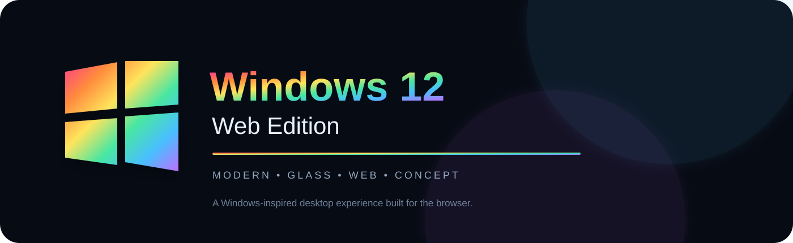
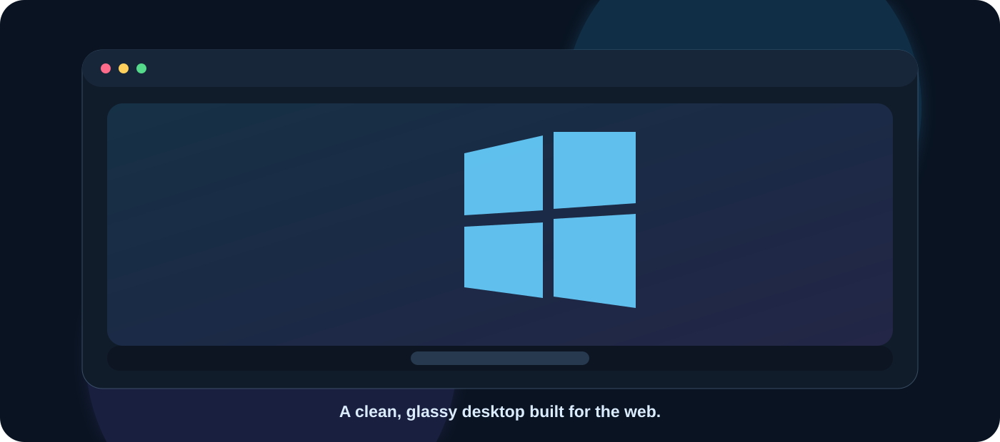
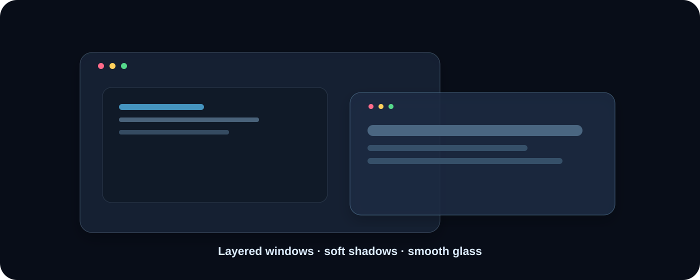
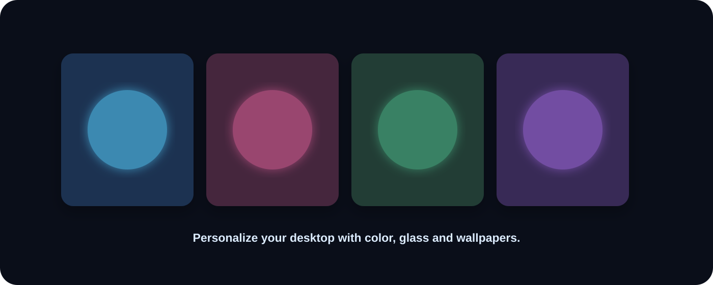
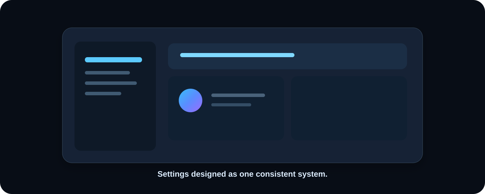
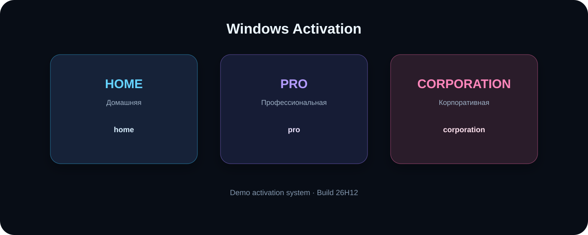
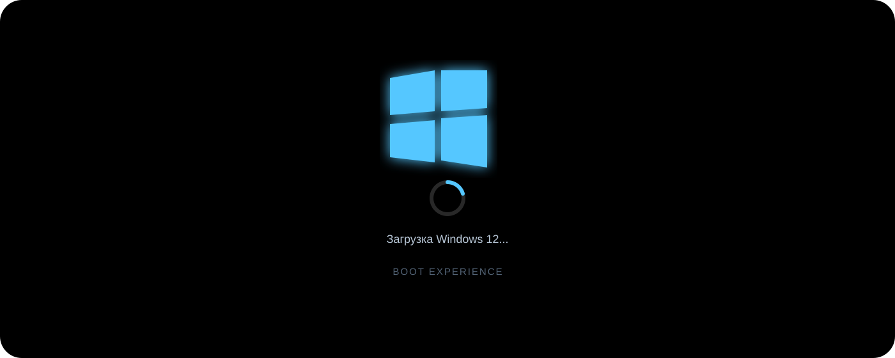
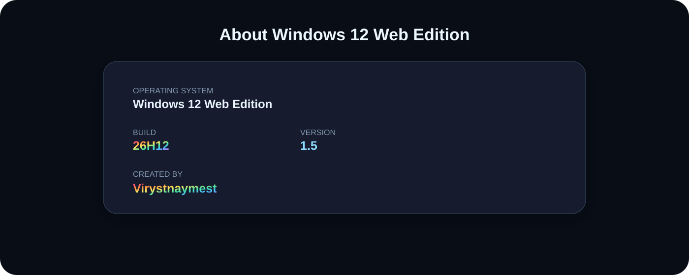
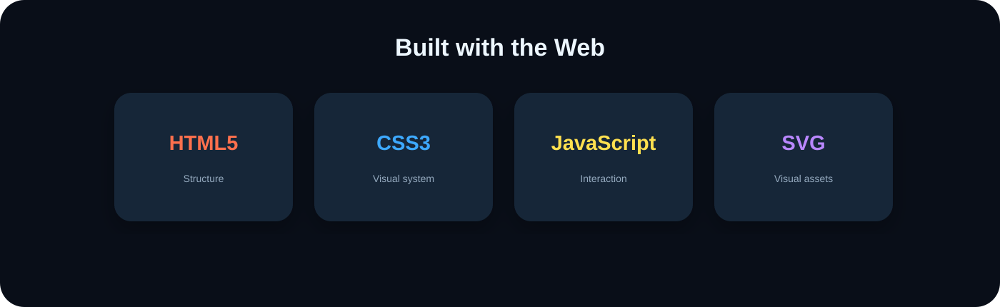
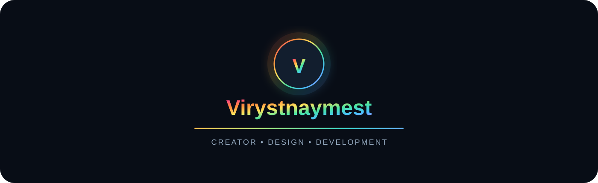

<div align="center">



# <ins>🌈 Windows 12 Web Edition</ins>

### <ins>Modern • Glass • Web • Concept</ins>

**Интерактивная концепция рабочего стола Windows, работающая прямо в браузере.**

<br>

[](./)
[](./)
[](./)
[](./)
[](./)

<br>

━━━━━━━━━━━━━━━━━━━━━━━━━━━━━━━━━━━━━━━━━━━━━━━━━━━━

</div>

## <ins>🪟 Windows 12 Desktop</ins>

<div align="center">

</div>

**Windows 12 Web Edition** переносит привычную концепцию рабочего стола в браузер: окна, панель задач, меню «Пуск», приложения, настройки и персонализация объединены в единую визуальную систему.

> ✨ **Главная идея:** создать ощущение полноценного современного рабочего стола без установки настоящей операционной системы.

---

## <ins>🪟 Window System</ins>

<div align="center">

</div>

### <ins>Единый стиль окон</ins>

Каждый элемент интерфейса использует одну дизайн-систему:

- **Glass UI** — прозрачность и мягкое размытие;
- **Rounded corners** — единые скругления;
- **Soft shadows** — аккуратные тени;
- **Smooth transitions** — плавные переходы;
- **Consistent spacing** — одинаковые отступы и размеры.

---

## <ins>🎨 Personalization</ins>

<div align="center">

</div>

### <ins>Сделай рабочий стол своим</ins>

В проекте предусмотрена персонализация рабочего стола и несколько вариантов визуального оформления.

**Обои:**  
`Aurora` · `Sunset` · `Ocean` · `Forest` · `Violet` · `Minimal` · `Crystal` · `Midnight` · `Desert` · `Sakura` · `Synthwave` · `Alpine` · `Cloud` · `Liquid Glass`

**Акцент:**  
`Blue` · `Purple` · `Pink` · `Cyan` · `Rainbow`

---

## <ins>⚙️ Settings</ins>

<div align="center">

</div>

### <ins>Настройки в единой дизайн-системе</ins>

Настройки оформлены в том же стиле, что и рабочий стол: стеклянные панели, мягкие границы, аккуратные карточки и единые интерактивные состояния.

---

## <ins>🔑 Windows Activation</ins>

<div align="center">

</div>

### <ins>Демонстрационная система активации</ins>

Проект содержит интерфейс активации с тремя демонстрационными редакциями:

| 🏠 Редакция | 🔑 Код |
|:---:|:---:|
| **Домашняя** | `home` |
| **Профессиональная** | `pro` |
| **Корпоративная** | `corporation` |

> ⚠️ Это **симуляция активации внутри веб-интерфейса**. Она не активирует настоящую Windows и не является ключом Microsoft.

---

## <ins>⏳ Boot Experience</ins>

<div align="center">

</div>

### <ins>Загрузка Windows 12</ins>

При запуске отображается отдельный загрузочный экран:

**⬛ Чёрный фон → 🪟 голубой логотип → 🔄 вращающийся индикатор → 🖥️ рабочий стол**

Загрузка рассчитана на **5 секунд** и затем плавно исчезает.

---

## <ins>ℹ️ About the System</ins>

<div align="center">

</div>

### <ins>Сведения о системе</ins>

| Параметр | Значение |
|:---|:---|
| **OS** | Windows 12 Web Edition |
| **Build** | `26H12` |
| **Version** | `1.0.0.0` |
| **Creator** | `Virystnaymest` |
| **Platform** | Web Browser |

---

## <ins>🛠️ Technologies</ins>

<div align="center">

</div>

<div align="center">

**HTML5** · **CSS3** · **JavaScript** · **SVG** · **LocalStorage** · **CSS Animations**

</div>

---

## <ins>🚀 Launch</ins>

Запуск максимально простой:

```text
1. Скачайте репозиторий
2. Откройте HTML-файл
3. Windows 12 Web Edition запустится в браузере
```

Для лучшего результата рекомендуется использовать современный **Chrome, Edge, Firefox или Safari**.

---

## <ins>🗺️ Roadmap</ins>

- [x] 🖥️ Desktop
- [x] 🪟 Window system
- [x] 📌 Taskbar
- [x] 🔍 Start menu
- [x] ⚙️ Settings
- [x] 🎨 Personalization
- [x] 🌌 Wallpaper system
- [x] 🔑 Demo activation
- [x] ℹ️ About application
- [x] ⏳ Boot animation
- [x] 🪟 Glass UI
- [ ] 📁 Advanced file manager
- [ ] 🧩 More system applications
- [ ] 🎨 More themes
- [ ] 📱 Improved mobile experience
- [ ] ✨ More advanced animations

---

## <ins>👤 Creator</ins>

<div align="center">

</div>

<div align="center">

### <ins>Created by Virystnaymest</ins>

**Windows 12 Web Edition · Build 26H12**

<br>

⭐ **Если тебе нравится проект — поставь Star репозиторию!**

</div>

---

<div align="center">

### 🌈 <ins>Windows 12 Web Edition</ins>

**Modern • Glass • Web • Concept**

<br>


</div>

> **Disclaimer:** Windows является товарным знаком Microsoft Corporation. Этот проект является независимой веб-концепцией и не является официальным продуктом Microsoft!

