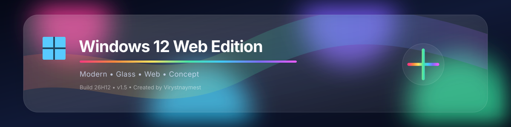
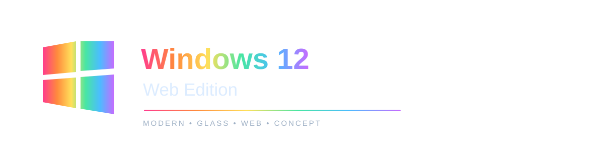
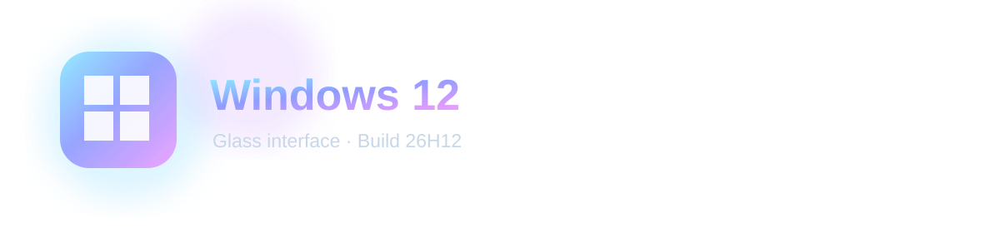
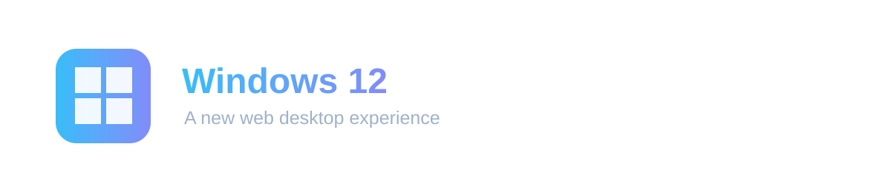
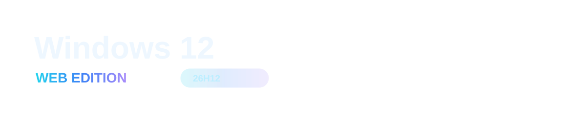
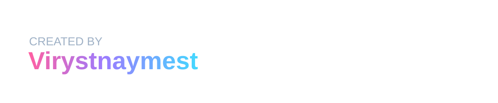

  

 #Windows 12 
 🪟 Windows 12 Web Edition

Windows 12 Web Edition — это интерактивная веб-имитация современного рабочего стола Windows, созданная с акцентом на красивый интерфейс, плавные анимации и ощущение полноценной операционной системы прямо в браузере.

«⚠️ Это не настоящая операционная система Windows и не является официальным продуктом Microsoft. Проект представляет собой веб-интерфейс и концепт Windows 12.»

✨ Возможности

- 🖥️ Современный рабочий стол в стиле Windows 12
- 🪟 Стеклянный интерфейс и эффекты Acrylic / Glassmorphism
- 📌 Панель задач
- 🔍 Меню «Пуск»
- 📂 Окна и приложения
- ⚙️ Центр настроек
- 🎨 Несколько вариантов обоев
- 🌌 Новые динамичные варианты оформления рабочего стола
- 🔄 Сохранение выбранных настроек в браузере
- 🔑 Система демонстрационной активации Windows
- ℹ️ Приложение «О программе»
- 🔄 Анимация загрузки Windows
- ⚡ Оптимизированные визуальные эффекты
- 📱 Адаптация интерфейса под разные размеры экрана

🔑 Редакции Windows

В проекте предусмотрены три демонстрационные редакции:

Редакция| Код
🏠 Домашняя| "home"
🏢 Корпоративная| "corporation"
💼 Профессиональная| "pro"

Активация является частью симуляции интерфейса и не активирует настоящую Windows.

ℹ️ Информация о системе

В приложении «О программе» отображается:

- Windows 12 Web Edition
- Редакция Windows
- Состояние активации
- Вид активации
- Код сборки: 26H12
- Версия: 1.5
- Создано: Virystnaymest

🎨 Интерфейс

Проект использует единый визуальный стиль Windows 12:

- полупрозрачные панели;
- размытие фона;
- скруглённые окна;
- мягкие тени;
- современные кнопки;
- единая цветовая система;
- плавные переходы и анимации;
- минималистичные системные иконки.

🚀 Запуск

Проект не требует установки.

1. Скачайте проект.
2. Распакуйте архив.
3. Откройте HTML-файл в браузере.

Для полноценной работы рекомендуется использовать современный браузер на основе Chromium, Firefox или Safari.

🛠️ Технологии

Проект создан с использованием:

- HTML5
- CSS3
- JavaScript
- LocalStorage
- CSS Animations
- CSS Backdrop Filter
- SVG / системных иконок

📦 Версия

Windows 12 Web Edition — v1.5

Build: "26H12"

Creator: "Virystnaymest"

📸 Скриншоты

Добавьте сюда скриншоты проекта:

screenshots/
├── desktop.png
├── start-menu.png
├── settings.png
└── about.png

🗺️ Планы развития

В будущих версиях планируется:

- [ ] Улучшить файловый менеджер
- [ ] Добавить больше системных приложений
- [ ] Добавить дополнительные темы
- [ ] Улучшить систему окон
- [ ] Добавить больше анимаций
- [ ] Улучшить мобильную версию
- [ ] Добавить больше вариантов обоев
- [ ] Улучшить панель быстрых настроек
- [ ] Добавить дополнительные настройки персонализации

📄 Лицензия

Проект распространяется в соответствии с лицензией, указанной в репозитории.

👤 Автор

Virystnaymest

---

⭐ Если вам нравится проект, поставьте репозиторию звезду на GitHub!

Windows 12 Web Edition — современный Windows-подобный интерфейс прямо в браузере.

🌈 Modern • Glass • Web • Concept

Windows 12 Web Edition — современная веб-концепция рабочего стола Windows, созданная для браузера с использованием HTML, CSS и JavaScript.

---

🪟 О проекте

Windows 12 Web Edition — это попытка перенести атмосферу современной операционной системы прямо в браузер.

Проект включает интерактивный рабочий стол, окна, приложения, настройки, персонализацию и визуальные эффекты в стиле современной Windows.

 ---

✨ Возможности

🖥️ Рабочий стол| 🪟 Окна| ⚙️ Настройки
Современный интерфейс| Перемещение и управление| Персонализация
Красивые обои| Glass-эффекты| Системные параметры

🎨 Персонализация| 🔑 Активация| ℹ️ О программе
Несколько обоев| 3 редакции| Информация о системе
Цветовые эффекты| Home / Pro / Corporation| Build 26H12

---

🎨 Дизайн

Проект использует собственную визуальную систему:

🔵 Windows Blue
Основной системный стиль с голубыми и синими акцентами.

🌈 Rainbow Gradient
Градиентные элементы для современного и необычного оформления.

🪟 Glass UI
Полупрозрачные панели, размытие, мягкие тени и скруглённые элементы.

✨ Smooth UI
Плавные переходы и анимации интерфейса.

---

🖼️ Персонализация

В Windows 12 Web Edition доступны различные варианты оформления рабочего стола:

"Aurora" · "Sunset" · "Ocean" · "Forest" · "Violet" · "Minimal"

А также дополнительные современные варианты:

"Crystal" · "Midnight" · "Desert" · "Sakura" · "Synthwave" · "Alpine" · "Cloud" · "Liquid Glass"

---

🔑 Активация

В интерфейсе присутствует демонстрационная система активации Windows.

Редакция| Код
🏠 Домашняя| "home"
🏢 Корпоративная| "corporation"
💼 Профессиональная| "pro"

«⚠️ Активация является частью симуляции интерфейса и не активирует настоящую операционную систему Windows.»

---

ℹ️ Информация

Операционная система: Windows 12 Web Edition
Редакция: отображается в приложении «О программе»
Build: "26H12"
Version: "1.5"
Creator: "Virystnaymest"

 ---

🚀 Запуск

Проект работает непосредственно в браузере.

1. Скачать репозиторий
2. Открыть HTML-файл
3. Наслаждаться Windows 12 Web Edition

Не требуется установка настоящей Windows или дополнительного программного обеспечения.

---

🛠️ Используемые технологии

"HTML5" (https://img.shields.io/badge/HTML5-E34F26?style=for-the-badge&logo=html5&logoColor=white)
"CSS3" (https://img.shields.io/badge/CSS3-1572B6?style=for-the-badge&logo=css3&logoColor=white)
"JavaScript" (https://img.shields.io/badge/JavaScript-F7DF1E?style=for-the-badge&logo=javascript&logoColor=black)

HTML5 • CSS3 • JavaScript • SVG • LocalStorage • CSS Animations

---

🗺️ Roadmap

- [x] Windows 12 Desktop
- [x] Панель задач
- [x] Меню «Пуск»
- [x] Настройки
- [x] Персонализация
- [x] Смена обоев
- [x] Система активации
- [x] О программе
- [x] Boot Animation
- [x] Glass UI
- [ ] Дополнительные системные приложения
- [ ] Улучшенный файловый менеджер
- [ ] Больше тем оформления
- [ ] Новые анимации
- [ ] Улучшенная мобильная версия

---

🌈 Windows 12 Web Edition

Made with HTML • CSS • JavaScript

Created by Virystnaymest

⭐ Если проект вам понравился — поставьте репозиторию Star!

